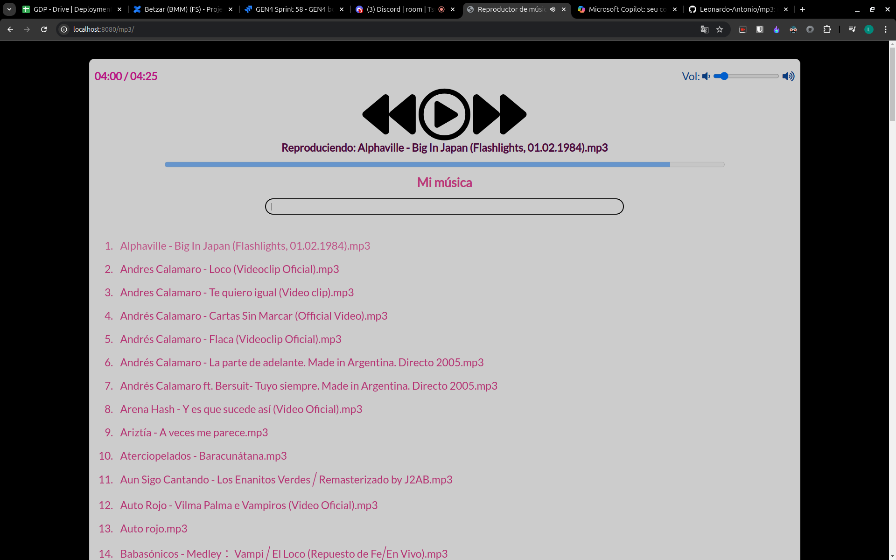
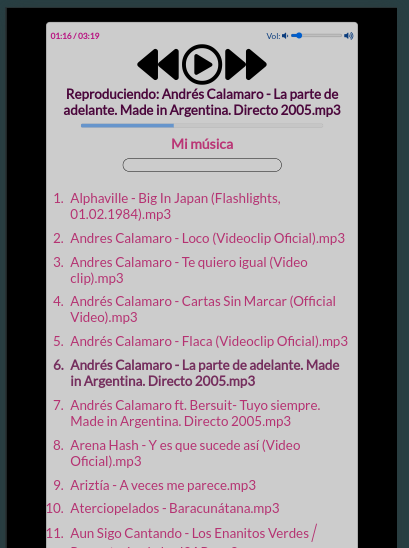

# MP3

## Desktop
{width='1000px'}

## Mobile
{width='400px'}

## Configuración
- Bajar el repositorio
```bash
git clone https://github.com/Leonardo-Antonio/playlist.git
```
- Instalar dependencias
```bash
go mod tidy
```
- Colocar tus canciones en la carpeta `music`
- Ejecutar el servidor
```bash
go run main.go
```